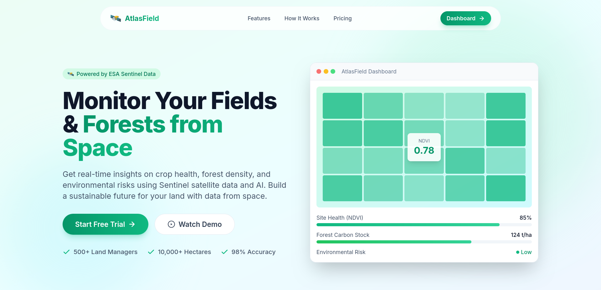
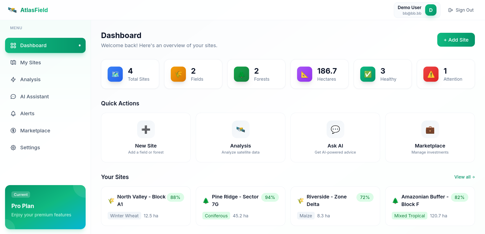
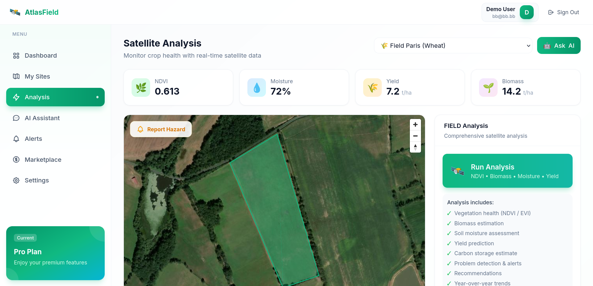
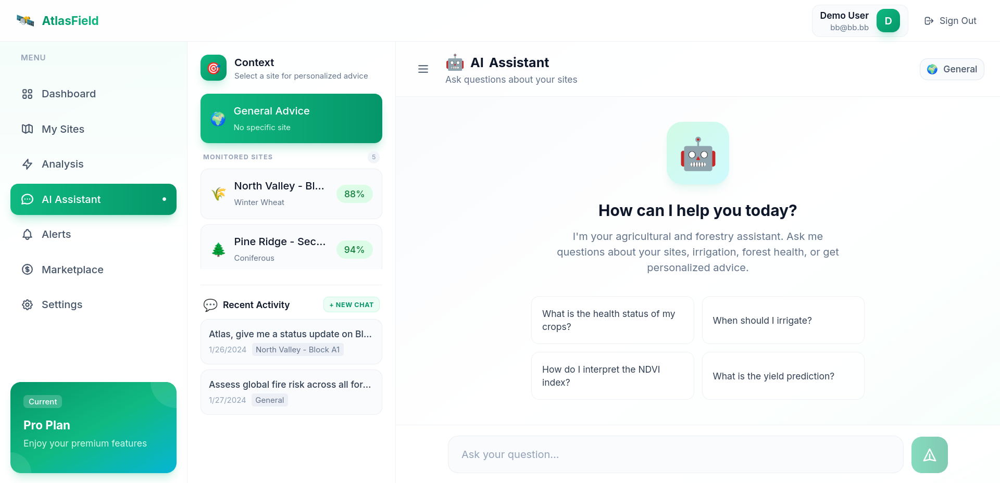

# Atlas Field & Forest Monitoring

Atlas is a state-of-the-art satellite monitoring platform designed for agricultural fields and forest management. It leverages multi-sensor data fusion, advanced AI analysis, and real-time alerts to provide comprehensive insights into land health, risks, and productivity.

## 🚀 Features

- **Multi-Sensor Fusion**: Combines Sentinel radar and optical imagery to provide clear analysis even through persistent cloud cover.
- **Fire & Risk Detection**: Early detection of fire signs and moisture stress to prevent environmental damage.
- **Forest Health & Carbon Monitoring**: Track canopy cover, species health, and estimate carbon stock changes.
- **Stare-of-the-art Indices**: Access high-resolution reports including NDVI (Vegetation), NBR (Burn Ratio), and NDMI (Moisture).
- **Real-Time Alerts**: Instant notifications for fire risks, pest threats, and soil anomalies.
- **AI Site Assistant**: An intelligent chatbot powered by Gemini to answer specific questions about your sites and historical data.
- **Investor Scorecard**: Detailed attractiveness scores and ROI estimates for land investments.

## 📸 Screenshots

### Landing Page



### Dashboard



### Analysis Page



### AI Chatbot



## 🔐 Authentication & Demo Accounts

This project uses **NextAuth.js** for session management. For demonstration purposes, it is configured with a **Mock Mode** by default.

### Using Demo Accounts

- You can sign in with **any email and password**.
- The system will automatically log you into a "Demo User" account.
- If you need to test the real backend authentication, set `USE_MOCK = false` in [lib/auth.ts](file:///home/mehdi/Documents/ex/Atlas/lib/auth.ts) and [lib/api.ts](file:///home/mehdi/Documents/ex/Atlas/lib/api.ts).

### Minimal Setup for Mock Demo

To run the app in mock mode (without a backend), you only need these 4 keys:

1. `NEXTAUTH_URL` (set to `http://localhost:3000`)
2. `NEXTAUTH_SECRET` (any random string)
3. `NEXT_PUBLIC_MAPTILER_KEY` (for maps)
4. `GEMINI_API_KEY` (for the AI assistant)

All other variables can be left empty as long as `USE_MOCK = true` remains in the code.

## 🛠️ Tech Stack

- **Framework**: [Next.js 15](https://nextjs.org/) (App Router)
- **Language**: [TypeScript](https://www.typescriptlang.org/)
- **Styling**: [Tailwind CSS](https://tailwindcss.com/)
- **Maps**: [MapLibre GL](https://maplibre.org/) / [React Map GL](https://visgl.github.io/react-map-gl/)
- **Data Visualization**: [Recharts](https://recharts.org/)
- **AI Engine**: [Google Gemini Pro](https://ai.google.dev/)
- **Satellite Data**: [Sentinel Hub](https://www.sentinel-hub.com/) (Copernicus)
- **Authentication**: [NextAuth.js](https://next-auth.js.org/)

## 🏁 Getting Started

### Prerequisites

- Node.js 20+
- npm or yarn
- API Keys for:
  - Gemini AI
  - Sentinel Hub
  - MapTiler (or Mapbox)

### Installation

1. **Clone the repository**:

   ```bash
   git clone https://github.com/your-repo/atlas.git
   cd atlas
   ```

2. **Install dependencies**:

   ```bash
   npm install
   ```

3. **Set up environment variables**:
   Copy `.env.example` to `.env.local` and fill in your API keys.

   ```bash
   cp .env.example .env.local
   ```

4. **Run the development server**:

   ```bash
   npm run dev
   ```

   Open [http://localhost:3000](http://localhost:3000) with your browser to see the result.

## � Deployment

### Deploying to Vercel

When deploying to [Vercel](https://vercel.com/), you need to set the following Environment Variables in your project settings:

| Variable | Description |
| :--- | :--- |
| `NEXTAUTH_URL` | Your production URL (e.g., `https://your-app.vercel.app`) |
| `NEXTAUTH_SECRET` | A random 32-character string |
| `NEXT_PUBLIC_API_URL` | URL of your backend API (if separate) |
| `GEMINI_API_KEY` | Your Google AI Studio key |
| `NEXT_PUBLIC_MAPTILER_KEY` | Your MapTiler API key |
| `SENTINEL_HUB_CLIENT_ID` | Sentinel Hub Client ID |
| `SENTINEL_HUB_CLIENT_SECRET` | Sentinel Hub Client Secret |

> [!TIP]
> Vercel automatically sets `VERCEL_URL`, but NextAuth.js requires `NEXTAUTH_URL` to be explicitly set for many features to work correctly in production.

## �📂 Project Structure

- `app/`: Next.js App Router pages and API routes.
- `components/`: Reusable UI components, organized by domain (landing, dashboard, marketplace, map).
- `lib/`: Utility functions, API clients, and shared logic.
- `types/`: TypeScript type definitions.
- `public/`: Static assets like icons and images.

## 📄 License

This project is private and proprietary.
